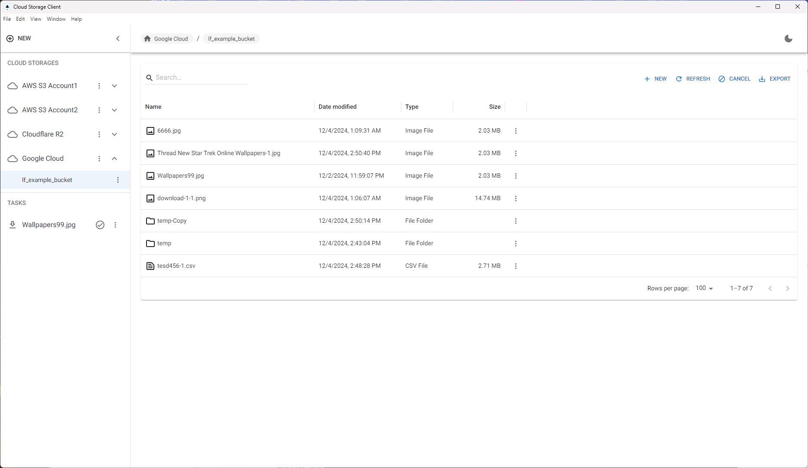

## Cloud Storage Desktop Application
It is a freeware cloud storage desktop client, you can manage your cloud storage file like local.
The app is build by [Electron](https://www.electronjs.org/) , so it would be an cross-platform desktop apps, it will support Windows. MacOS, Linux. 

## Supported cloud storage

Please find supported storage below, and we will add more
- Amazon S3 Storage
- Amazon S3 Compatible Storage
- Google Storage

## Features
- Browse, Preview, Clone, Create, Delete files/folder from cloud storage.
- Reliably Upload and Download your files/folder to and from cloud storage.
- Move,Copy files/folder between buckets.
- Export files list into CSV

## Safe storage

Encryption and decryption of account configuration for cloud storage on the local machine. more details
on [ElectronJS safe storage](https://www.electronjs.org/docs/latest/api/safe-storage)

- MacOS: Encryption keys are stored for your app in Keychain Access in a way that prevents other applications from
  loading them without user override. Therefore, content is protected from other users and other apps running in the
  same userspace.
- Windows: Encryption keys are generated via DPAPI. As per the Windows documentation: "Typically, only a user with the
  same logon credential as the user who encrypted the data can typically decrypt the data". Therefore, content is
  protected from other users on the same machine, but not from other apps running in the same userspace.

## Overview


## Development
### Requirements
- Node.js v20 + 
- [Nextron](https://github.com/saltyshiomix/nextron)

### Install dependencies

```
npm install
```

### Build for Development
```
npm build
```

## License

This project is licensed under the terms of the [MIT license](https://github.com/half-6/cloud-storage-client/blob/main/LICENSE).