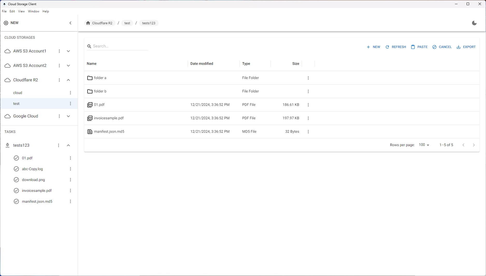

## Cloud Storage Desktop Application
It is a freeware cloud storage desktop client, you can manage your cloud storage file like local.
The app is build by [Electron](https://www.electronjs.org/) , so it would be an cross-platform desktop apps, it will support Windows. MacOS, Linux. 

## Supported cloud storage

Please find supported storage below, and we will add more
- Amazon S3 Storage
- Amazon S3 Compatible Storage
- Google Storage

## Features
- Browse, Preview, Clone, Create, Delete files/folder from cloud storage.
- Reliably Upload and Download your files/folder to and from cloud storage.

## Overview


## Development
### Requirements
- Node.js v20 + 
- [Nextron](https://github.com/saltyshiomix/nextron)

### Install dependencies

```
npm install
```

### Build for Development
```
npm build
```

## License

This project is licensed under the terms of the [MIT license](https://github.com/half-6/cloud-storage-client/blob/main/LICENSE).